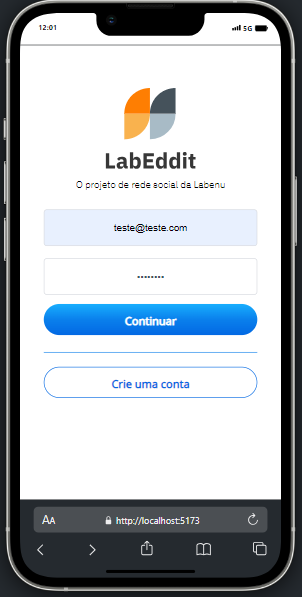
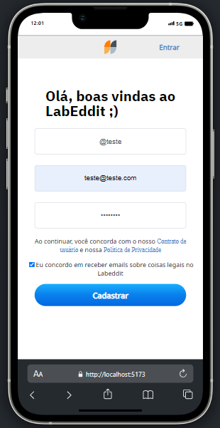
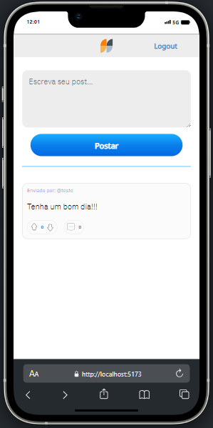
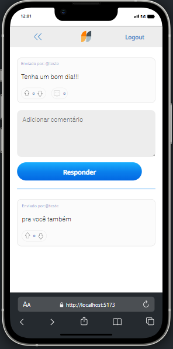

# Projeto Labeddit Full Stack

#### O Labeddit Full Stack é um desafio final do bootcamp Web Full Stack da Labenu, que abrange desenvolvimento em backend e frontend. O foco é criar um aplicativo com design mobile-first, com ênfase na criação de uma API, implementando funcionalidades como autenticação de usuários e gerenciamento de banco de dados.

### [Acesse aqui o LABEDDIT](https://rafaellabeddit.surge.sh)

[Repositório back-end](https://github.com/Rlopesn/Labecommerce-backend)

### Detalhes
- Site constitui em 4 páginas: Login, Signup, Postagem e Comentários.

#### Página de Login
- Formulário de login contendo campos para e-mail e senha.
- Botão "criar conta" direcionando o usuário a página de Signup.

#### Página de Signup (Cadastro)
- Formulário de cadastro de novo usuário, contendo campos de nome, e-mail e senha, contendo validação dos campos garantindo as informações enviadas.

#### Página de Postagens

- Exibe caixa de texto para realizar a postagem.
- Exibe lista de todas as postagens feitas no app.
- Cada postagem é representado por um card, contendo: nome do autor(a), conteudo, opção para like e dislike, total de likes, dislikes e comentários da postagem.

#### Página de Comentários
- Exibe a postagem escolhida juntamente com o conteúdo, o autor(a) e a opção de dar like e dislike com o total de likes.
- Uma caixa de texto tando a opção de fazer um comentário sobre a postagem.
- Abaixo da postagem, há uma seção de comentários que lista todos os comentários feitos sobre essa postagem.
- Cada comentário é representado por um card, contendo: nome autor(a), conteudo, opção de like e dislike.

